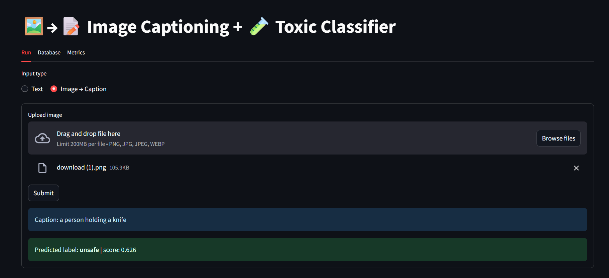
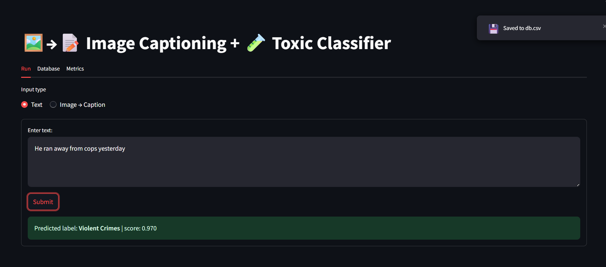
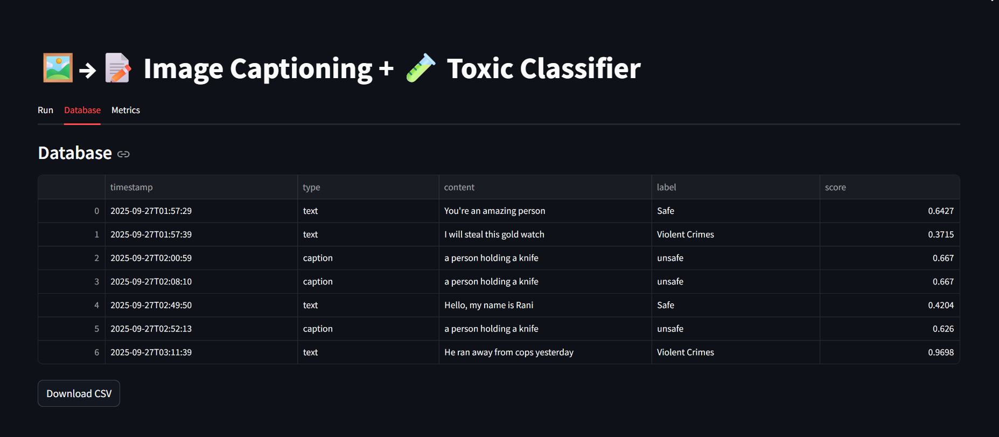

# Caption + Classify App

This project combines **image captioning** and **text classification** in a Streamlit app.

- Upload an image → BLIP generates a caption.  
- Enter text or use the caption → DistilBERT (with optional LoRA) classifies it.  
- Results are saved automatically to **db.csv** (a log of all user inputs and predictions).  
- You can also keep a labeled dataset (**Data.csv**) for training or retraining the classifier.

---

## 📸 Screenshots / Demo

Add images or GIFs of the app here (recommended size: ~800px wide).

Example:

  
*Uploading an image to generate a caption.*

  
*Text classification result shown in the app.*

  
*Viewing auto-saved predictions in db.csv.*

---

## 📂 Project Structure

caption_classify/

├─ imagecaption.py # BLIP captioning

├─ classifier.py # DistilBERT classifier (with optional LoRA)

├─ train_distilbert_lora.py # Fine-tune DistilBERT with LoRA

├─ streamlit_app.py # Streamlit UI

├─ Data.csv # Training dataset (text + label)

├─ db.csv # Auto-updating log of all app submissions

├─ requirements.txt # Dependencies

└─ README.md


---

## 🚀 How to Run Locally

Make sure you have **Python 3.10+** installed.

Create and activate a virtual environment:

```bash
python -m venv .venv
source .venv/bin/activate       # On Windows: .venv\Scripts\activate
```
Install dependencies:

```bash
pip install -r requirements.txt
```
Run the app:

```bash
streamlit run streamlit_app.py
```
Open the link shown in the terminal (usually http://localhost:8501
)

☁️ How to Run on Google Colab

Install the requirements:
```bash
!pip install -r /content/caption_classify/requirements.txt
```

Start the Streamlit server on port 8501:

```bash
!pkill -f streamlit || true
!python -m streamlit run /content/caption_classify/streamlit_app.py \
    --server.port 8501 --server.address 0.0.0.0 >/content/st_log.txt 2>&1 &
```

If you want a public link, install pyngrok and connect with your token:
```bash
!pip install pyngrok
```
```bash

from pyngrok import ngrok
ngrok.set_auth_token("YOUR_NGROK_TOKEN")
print("Public URL:", ngrok.connect(8501).public_url)
```

🎓 Training DistilBERT with LoRA

Use Data.csv as your labeled dataset (columns: text, label).

Run:
```bash
python train_distilbert_lora.py \
  --train_csv Data.csv \
  --text_col text \
  --label_col label \
  --output_dir outputs_distilbert_lora
```
The trained adapter will be saved in outputs_distilbert_lora/.
The classifier automatically loads it if available.

📦 Requirements

Main dependencies (see requirements.txt):

streamlit
pillow
transformers
accelerate
bitsandbytes
torch
scikit-learn
pandas
numpy
peft


📝 Notes

Data.csv → for training (you can add or edit labeled examples).

db.csv → auto-updated by the app whenever a user submits input (stores text/caption, classification, and timestamp).

imagecaption.py → loads BLIP for image captioning.

classifier.py → loads DistilBERT (with LoRA if present).

streamlit_app.py → the Streamlit interface.

🔒 Suggested .gitignore

```bash
__pycache__/
*.pt
*.bin
*.ckpt
st_log.txt
outputs_distilbert_lora/
```

✅ Quick Summary

```bash
# 1. Install requirements
pip install -r requirements.txt

# 2. Run the app
streamlit run streamlit_app.py

# 3. Upload an image or enter text
# 4. Get caption + classification
# 5. Every run is saved in db.csv
# 6. Use Data.csv if you want to fine-tune DistilBERT
```
